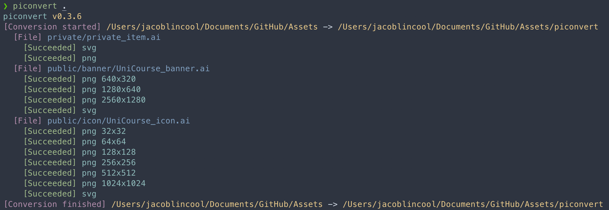

# piconvert

Convert pictures to other formats. GitHub Actions, CLI Tool, and Node Package.

## Features

- Import (input) formats: `ai`, `cdr`, `vsd`, `pdf`, `jpg`, `png`, `gif`, and `bmp`
- Export (output) formats: `svg`, `png`, `ps`, `eps`, `pdf`, `emf`, `wmf`, and `xaml`.

## Usage

### GitHub Actions

```yaml
- name: Piconvert
  uses: JacobLinCool/piconvert@0.4.2
    with:
      src: ./pictures
      dist: ./piconvert
      inputs: ai
      outputs: svg,png
      force: false
      verbose: false
```

See [action.yml](./action.yml) for more details.

### CLI Tool

```bash
npm install -g piconvert
```

```
Usage: piconvert [options] [path]

Arguments:
  path                     Source path. If it's a directory, all files matched selected import types in it and its subdirectories will be converted. (default: "pictures")

Options:
  -V, --version            output the version number
  -d, --dir <directory>    Output directory (default: "piconvert")
  -i, --inputs <formats>   Import (input) formats. Supports: ai,cdr,vsd,pdf,jpg,jpeg,png,gif,bmp (default: "ai")
  -o, --outputs <formats>  Export (output) formats. Supports: svg,png,ps,eps,pdf,emf,wmf,xaml (default: "svg,png")
  -f, --force              Overwrite existing files (default: false)
  -s, --silent             Silent mode, no output (default: false)
  -v, --verbose            Verbose mode, print all Inkscape output (default: false)
  -h, --help               display help for command

Commands:
  install [options]
```



### Library

```bash
npm install piconvert
# or: yarn add piconvert
# or: pnpm install piconvert
```

```javascript
const { Converter } = require("piconvert");
// or using ESM "import":
// import { Converter } from "piconvert";

const converter = new Converter()
  .import("ai")
  .export("svg")
  .export("png", [128, 256, "256x128", "x512"]);

converter.run("./src", "./dest");
```

## Config File

There are two types of config files: folder-level and file-level.

### Folder-level Config File

The folder-level config file is a YAML file named `piconvert.yml`, `piconvert.yaml`, `.piconvert.yml`, or `.piconvert.yaml`.

The configurations in this file will be applied to all files in the folder.

### File-level Config File

The file-level config file is a YAML file named with the same name as the source file, for `picture_123.ai`, it should be named `picture_123.yml` or `picture_123.yaml`.

### Config File Structure

The config file structure is as follows:

```yaml
svg:
png:
  - 128
  - "256x128"
  - "x512"
pdf:
```

All the keys in the config file are supported export formats with an optional value of sizes.

### Priority

The priority of config files is as follows:

1. File-level config file
2. Folder-level config file
3. Parent folder-level config file (if exists)
4. Default configs

## Requirement

If you are using GitHub Actions, then you don't need to install any dependencies.

But if you are using the cli tool on your computer, make sure you have installed `inkscape` first.

(You can use `piconvert install` to install `inkscape`. On linux, it uses `apt`. On macOS, it uses `brew`. On Windows, it uses `choco`.)

## Links

- [GitHub Actions](https://github.com/marketplace/actions/piconvert)
- [Repository](https://github.com/JacobLinCool/piconvert)
